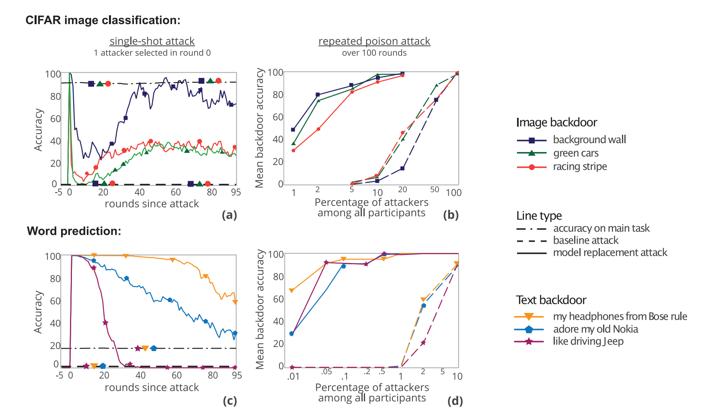

2020-Aistats-How To Backdoor Federated Learning
===
> Cornell University `401 Citations`
### 摘要
联邦学习使成千上万的参与者能够构建一个深度学习模型，而不需要彼此共享他们的私人训练数据。例如，多款智能手机可以联合训练键盘的下一个单词预测器，而不透露个人用户的类型。

联邦模型是通过聚合参与者提交的模型更新来创建的。为了保护训练数据的机密性，根据设计的聚合器不了解这些更新是如何生成的。我们表明，这使得联邦学习容易受到模型中毒攻击，而模型中毒攻击明显比只针对训练数据的中毒攻击更强大。

恶意参与者可以使用模型替换（model replacement）向联合模型引入后门功能，例如，修改图像分类器，使其为攻击者为具有特定特征的图像分配攻击者选择的标签，或者强迫单词预测器用攻击者选择的单词完成特定的句子。这些攻击可以由单个参与者或多个合并的参与者执行。我们评估了标准联邦学习任务的模型替换（model replacement），表明它的性能大大优于训练数据中毒

联邦学习采用安全聚合来保护参与者局部模型的机密性，因此不能通过检测参与者对联合模型贡献的异常情况来阻止我们的攻击。为了证明异常检测在任何情况下都是不有效的，我们还开发并评估了一种通用的约束和尺度技术，该技术在训练期间将逃避防御整合到攻击者的损失函数中。

### 背景动机
本文是第一次提出模型中毒攻击，提出联邦模型很容易收到后门攻击或其他中毒攻击：不能针对数据进行异常检测。保证联邦学习模型在正常任务和后门任务上都有一定的准确性。

> 攻击能成功的一个因素是：联邦学习的大部分数据都是no-i.i.d的不好区分

### 具体实现
参数聚合方式：$$G^{t+1}=G^{t}+\frac{\eta}{n} \sum_{i=1}^{m}\left(L_{i}^{t+1}-G^{t}\right)$$

其中 $L_{i}^{t+1}$是每个本地模型上传的参数（联邦平均算法），$G^{t}$是上一轮的聚合模型参数

论文的核心在于如何用一个攻击方想用的后门模型来代替联邦模型

设后门模型为$X$:
$$X=G^{t}+\frac{\eta}{n} \sum_{i=1}^{m}\left(L_{i}^{t+1}-G^{t}\right)$$

当模型接近收敛时$\sum_{i=1}^{m-1}\left(L_{i}^{t+1}-G^{t}\right) \approx 0$，所以每次要上传的本地模型为
$$
\widetilde{L}_{m}^{t+1}=\frac{n}{\eta} X-\left(\frac{n}{\eta}-1\right) G^{t}-\sum_{i=1}^{m-1}\left(L_{i}^{t+1}-G^{t}\right) \approx \frac{n}{\eta}\left(X-G^{t}\right)+G^{t}
$$

**Constrain-and-scale(松紧方式)：**

通过使用一个目标函数来将逃避异常检测纳入训练

训练backdoor模型$X$的两个原则
（1）奖励模型的准确性
（2）惩罚它偏离了聚合器认为的“正常”的东西。
$$
\mathcal{L}_{\text {model }}=\alpha \mathcal{L}_{\text {class }}+(1-\alpha) \mathcal{L}_{\text {ano }}
$$
$$\mathcal{L}_{\text {ano }}=1-\cos \left(L, G^{t}\right)$$

**Train-and-scale（上传维度）：**

控制攻击方影响全局模型的参数$\gamma$
$$
\gamma=\frac{S}{\left\|X-G^{t}\right\|_{2}}
$$

估计参数值$S$的方法：

（1）牺牲一部分的攻击者，不断的提高$S$来试探检测边界

（2）先训练一些小模型估计良性模型的参数分布，在把$S$这个分布的上届附近

 $\mathcal{L}_{\text {class }}$是后门模型的分类损失（同时对正常任务和后门任务），$\mathcal{L}_{\text {ano }}$可以是权值矩阵之间的p范数距离或更高级的权值可塑性惩罚

训练后门模型的算法流程：

### 实验结果
三个维度：
**image：**设置一些后门图片，针对CIFAR比如带条纹背景的汽车，绿色汽车，赛车条纹汽车
**word：**随机选一些后门词汇
**Pixel-pattern：**选取一些图片加高斯噪音后做为后门图片，需要在训练和测试阶段都进行这个攻击
####Baseline：
数据投毒攻击，改变一定的标签，需要持续投毒
基本上一次攻击就能有比较好的表现：

