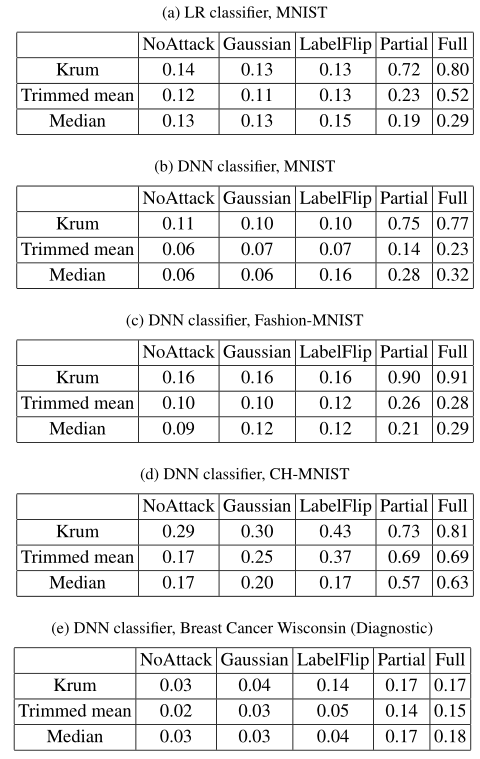
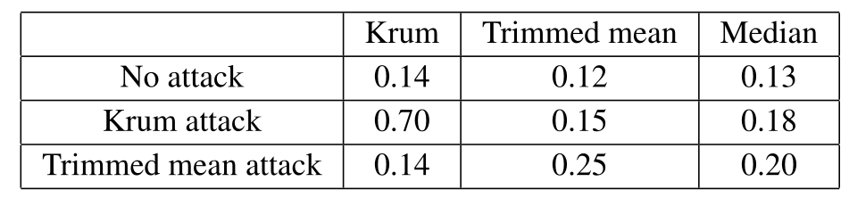

2020-usenix-Local Model Poisoning Attacks to Byzantine-Robust Federated Learning
===
>  Iowa State University, Duke University  `102 Citations`

### 背景和动机
***Local model poisoning***  本地模型投毒攻击

数据中毒攻击在攻击拜占庭健壮的联邦学习方面成功率不高

将攻击运用到四种主流的联邦学习方法***Krum, Bulyan, Trimmed mean, and Median***

推广了两种数据中毒攻击的防御方法来防御局部模型中毒攻击。我们的结果表明，虽然其中一种在某些情况下是有效的，但在其他情况下它们的成功有限（这么真实？）

> **Krum的思想**：
> 
> 计算$m$个参与方上传参数之间的欧氏距离，假设有$c$个参与方，对于每个局部模型$w_i$，主设备计算选择相对于欧几里得距离最接近$w_i$的$m−c−2$个局部模型。此外，主设备计算$w_i$与其最近的$m−c−2$个局部模型之间的距离平方和。Krum选择距离距离平方和最小的局部模型作为全局模型。

> **修整均值（Trimmed mean）思想：**
>
> 该聚集规则独立地聚集每个模型参数。具体地，对于每个第 $j $个模型参数，主设备对$ m $个局部模型的第 $j$ 个参数进行排序。删除其中最大和最小的$β$个参数，计算其余 $m-2β$个参数的平均值作为全局模型的第$ j$ 个参数。

>**中位数（Median）思想:**

>在中位数聚合规则中，对于第 j 个模型参数，主设备都会对 m 个局部模型的第 j 个参数进行排序，并将中位数作为全局模型的第 j 个参数。当 m 为偶数时，中位数是中间两个参数的均值。与修整均值聚集规则一样，当目标函数为强凸时，中位数聚集规则也能达到阶优误差率。

> **Bulyan思想就是多轮Krum+Trimmed mean**

### 具体做法
攻击者的目标（本文称其为有向偏离目标）是使全局模型的参数反向偏离没有攻击时的全局模型参数。假设在迭代中，$w_i $是使用第 $i $个工作节点设备计划在没有攻击时发送给主设备的局部模型。假定前 $c $个工作节点受到攻击。有向偏差目标是通过在每次迭代中解决以下优化问题，为受到攻击的工作节点设备制作局部模型：
$$
\begin{gathered}
\max _{\mathbf{w}_{1}^{\prime}, \cdots, \mathbf{w}_{c}^{\prime}} \mathbf{s}^{T}\left(\mathbf{w}-\mathbf{w}^{\prime}\right), \\
\text { subject to } \mathbf{w}=\mathcal{A}\left(\mathbf{w}_{1}, \cdots, \mathbf{w}_{c}, \mathbf{w}_{c+1}, \cdots, \mathbf{w}_{m}\right) \\
\mathbf{w}^{\prime}=\mathcal{A}\left(\mathbf{w}_{1}^{\prime}, \cdots, \mathbf{w}_{c}^{\prime}, \mathbf{w}_{c+1}, \cdots, \mathbf{w}_{m}\right)
\end{gathered}
$$

$s$代表参数的方向，参数值增加为$+$，参数值减少为$-$，优化目标其实就是让参数变化大

这篇论文主要针对不同的拜占庭鲁棒性聚合方式进行攻击：

针对***Krum***的攻击：

**已知完整模型情况下**：

第一步计算设置偏离模型参数
$$
\mathbf{w}_{1}^{\prime}=\mathbf{w}_{R e}-\lambda \mathbf{s}
$$

第二步让$c$个受控制方上传这个参数
$$
\mathbf{w}_{i}^{\prime}=\mathbf{w}_{1}^{\prime}, \text { for } i=2,3, \cdots, c
$$

**优化目标**
$$=\max _{\mathbf{w}_{1}^{\prime}, \cdots, \mathbf{w}_{c}^{\prime}} \mathbf{s}^{T}\left(\mathbf{w}-\mathbf{w}^{\prime}\right)\\
=\max_{\mathbf{w}_{1}^{\prime}, \cdots, \mathbf{w}_{c}^{\prime}}\mathbf{s}^{T}\left(\mathbf{w}-(\mathbf{w}_{R e}-\lambda \mathbf{s})\right)\\
=\max _{\mathbf{w}_{1}^{\prime}, \cdots, \mathbf{w}_{c}^{\prime}}\mathbf{s}^{T}\left(\mathbf{w}-\mathbf{w}_{R e}\right)+\lambda \mathbf{s}^{T} \mathbf{s}\\
=\max _{\lambda}\lambda  $$

$\lambda $的选取方法

上界：
$$
\begin{aligned}
\lambda \leq & \sqrt{\frac{1}{(m-2 c-1) d} \cdot \min _{c+1 \leq i \leq m} \sum_{l \in \tilde{\Gamma}_{\mathbf{w}_{i}}^{m-c-2}} D^{2}\left(\mathbf{w}_{l}, \mathbf{w}_{i}\right)} \\
&+\frac{1}{\sqrt{d}} \cdot \max _{c+1 \leq i \leq m} D\left(\mathbf{w}_{i}, \mathbf{w}_{R e}\right)
\end{aligned}
$$

下界：
$$
1 \times 10^{-5}
$$

从上界开始往下界取，折半递减

**已知部分模型情况下**：

大致相同，不同点在于用所有已知的$c$个被入侵方的模型来估计$\tilde{\mathbf{S}}$

如果我们在$λ$小于一个阈值之前不能找到一个解$λ$那么就再修改一个被入侵方的模型，直到求到$λ$

**针对***Trimmed mean***的攻击**：

采样的$c$参与方的$w$应接近$w_{max,j}$或$w_{min,j}$，以避免成为异常值导致容易被检测

如果$s_j = −1$,

在区间$\left[w_{\max , j}, b \cdot w_{\max , j}\right]\left(\right. when \left.w_{\max , j}>0\right)$或$\left[w_{\max , j}, w_{\max , j} / b\right]\left(\right. when \left.w_{\max , j} \leq 0\right)$内随机抽样c的参数

**部分模型情况下**：

用高斯分布假设$w_{\max , j}$和$w_{\min , j}$

### 实验分析
本文在四个数据库中进行实验：MNIST，FashionMNIST，CH-MNIST 和 Breast Cancer Wisconsin（诊断）数据库。MNIST 和 Fashion-MNIST 分别包含 60,000 个训练示例和 10,000 个测试示例，其中每个示例都是 28×28 灰度图像。这两个数据集都是 10 类分类问题。CH-MNIST 数据库包含来自结肠直肠癌患者的 5000 张组织切片图像。数据库是一个 8 类分类问题。每个图像具有 64×64 灰度像素。我们随机选择 4000 张图像作为训练示例，其余 1000 张作为测试示例。Breast Cancer Wisconsin（诊断）数据库是诊断人是否患有乳腺癌的二元分类问题。该数据集包含 569 个示例，每个示例都有 30 个描述一个人细胞核特征的特征。随机选择 455 个（80％）示例作为训练示例，并使用其余 114 个示例作为测试示例。

联邦学习架构中考虑的分类方法包括：多类逻辑回归（Multi-class logistic regression，LR）、深度神经网络（Deep neural networks ，DNN)。本文采用的攻击对比基线方法包括：高斯攻击（Gaussian attack）、标签翻转攻击（Label flipping attack）、基于反向梯度优化的攻击（Back-gradient optimization based attack）、全部知识攻击或部分知识攻击（Full knowledge attack or partial knowledge attack）。

随着 MNIST 上受到破坏的工作节点设备的百分比增加，不同攻击的错误率。随着受到破坏的工作节点设备数量的增加，本文的攻击会大大提高错误率。

针对未知聚合规则，作者基于某一个聚合规则构建局部模型，之后通过实验验证分析其对其他聚合规则的攻击效果。

### 防御
本文将用于防御数据中毒攻击的 RONI 和 TRIM 概括用于防御本文提出的的局部模型中毒攻击。在联邦学习的每次迭代计算全局模型之前，两种通用防御都删除了可能有害的局部模型。一种广义防御方法删除了对全局模型的错误率具有较大负面影响的局部模型（受 RONI 的启发，后者删除了对模型的错误率具有较大负面影响的训练示例），而另一种防御方法则除去了局部模型导致大量损失（受 TRIM 的启发，删除了对损失有较大负面影响的训练示例）。在这两种防御中，都假定主设备具有一个小的验证数据集。

>对于每个局部模型，当包含局部模型时，使用聚合规则来计算全局模型 A；

>在排除局部模型时，使用全局规则 B 来计算全局模型 B。
>
> 基于错误率的拒绝（Error Rate based Rejection，ERR）在验证集上计算全局模型 A 和 B 的错误率，分别记为 EA 和 EB，将 EA-EB 定义为局部模型的错误率影响。较大的 ERR 表示如果在更新全局模型时将局部模型包括在内，则局部模型会显着增加错误率。
> 
> 基于损失函数的拒绝（Loss Function based Rejection，LFR）。像基于错误率的拒绝一样，对于每个局部模型，计算全局模型 A 和 B。在验证数据库上计算模型 A 和模型 B 的交叉熵损失函数值，分别记为 LA 和 LB，将 LA-LB 定义为局部模型的损失影响。像基于错误率的拒绝一样，删除损失影响最大的 c 个局部模型，并汇总其余局部模型以更新全局模型。