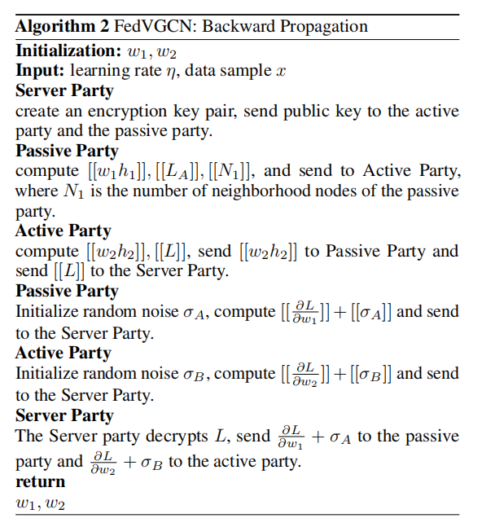
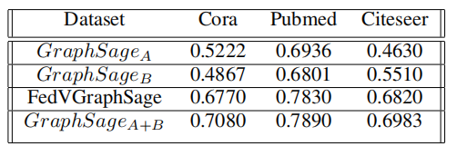

2021-arxiv-A Vertical Federated Learning Framework for Graph Convolutional Network
===
> 今年的关于纵向联邦图学习的论文，graphsage迁移到FL上，蚂蚁团队

### 摘要
近年来，图神经网络(GNN)在图数据上的各种现实问题上取得了显著的成功。然而在大多数行业，数据以孤立岛屿的形式存在，数据隐私和安全也是一个重要的问题。在本文中，我们提出了FedVGCN，一种用于数据垂直分区设置下的隐私保护节点分类任务的联邦GCN学习范式，可以推广到现有的GCN模型。具体来说，我们将计算图数据分为两部分。对于训练过程的每一次迭代，双方在同态加密下将中间结果相互传递。我们对基准数据进行了实验，结果证明了FedVGCN在GraphSage情况下的有效性。
### 主要内容
采用加法同态加密(HE)，以确保隐私，同时保持准确性。在三个基准数据集上的实验结果表明，我们的算法显著优于在孤立数据上训练的GNN模型，并取得了与在组合明文数据上训练的传统GNN相当的性能
### 模型实现

用最佳平方近似+泰勒近似来模拟Relu函数
 同态加密的方法类似于fate书中提到的，一样先理论推导梯度公式，然后分开计算再聚合凑出梯度的思想
 

### 实验证明
比单独一方持有数据效果都好，相比集中式的机器学习，性能下降较少。

### 总结
方法比较简单，主要贡献其实是Relu函数的近似，其他同态加密和多次通信凑梯度的做法相同与一般手法。思想基本上继承hardy的