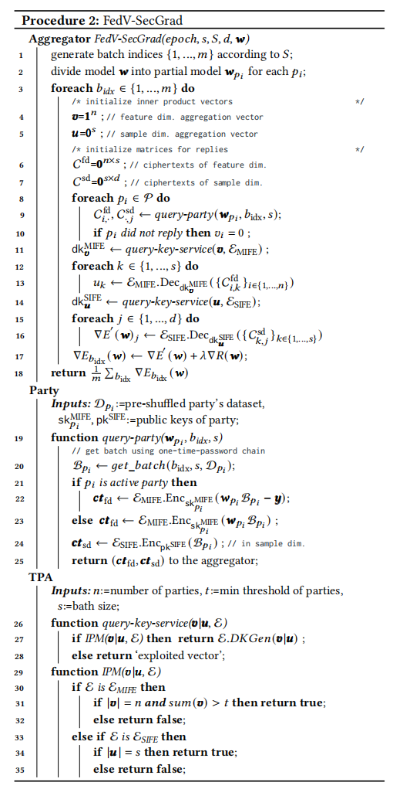

2021-arxiv-FedV Privacy-Preserving Federated Learning over Vertically Partitioned Data
===
### 摘要
联邦学习(FL)已经被提出允许在多方之间对机器学习(ML)模型的协作训练，其中双方都可以保持其数据私有。在这个范例中，只有模型更新，如模型权重或梯度。许多现有的方法都集中于水平FL，每个方都有训练数据集中的整个特征集和标签。然而，许多真实的场景遵循垂直分区的FL设置，其中只有当双方的所有数据集合并时，才会形成一个完整的特征集，并且标签只对一方可用。保护隐私的垂直FL具有挑战性，因为完整的标签和特征集不由一个实体拥有。现有的垂直FL方法需要双方之间的多种点对点通信，从而导致较长的训练时间，并且仅限于（近似的）线性模型和双方。为了缩小这一差距，我们提出了FedV，一个用于垂直设置中的安全梯度计算的框架，用于几种广泛使用的ML模型，如线性模型、逻辑回归和支持向量机。FedV通过使用功能加密方案消除了双方之间的点对点通信的需要；这使得FedV能够实现更快的训练时间。它也适用于更大的、不断变化的聚会集。我们通过经验证明了对多种类型的ML模型的适用性，并显示了与最先进的方法相比，训练时间减少了10%-70%，数据传输时间减少了80%到90%。
### 背景和动机

现有的纵向FL存在缺陷在于：
1. 只适用于有限的模型
2. 需要用泰勒级数近似来训练非线性模型或增加噪声扰动，导致模型性能下降且难以推广。
3. 需要各方之间大量的点对点通信

**Fedv**：不需要各方点对点通信+适用于线性回归、逻辑回归、支持向量机+不需要线性近似+减少了10%-70%的训练时间和80%-90%的数据传输
### 具体做法
实体对齐：同样是CLK
加密方式：*functional encryption for inner product (FEIP)*，可以用于计算密文$x$和明文$y$之间的点积
需要一个第三方机构提供*functionally derived key*，第三方机构需要知道明文$y$，不需要知道密文$x$
单输入的函数加密：
> Michel Abdalla, Florian Bourse, Angelo De Caro, and David Pointcheval. Simple functional encryption schemes for inner products. In IACR International Workshop on Public Key Cryptography, pages 733–751. Springer, 2015.

多输入的函数加密：
> Michel Abdalla, Dario Catalano, Dario Fiore, Romain Gay, and Bogdan Ursu. Multi-input functional encryption for inner products: function-hiding realizations and constructions without pairings. In Annual International Cryptology Conference, pages 597–627. Springer, 2018.

加密流程：
1. *TPA*根据一些安全参数生成加密公钥$p_k$
2. *TPA*根据$y$生成 *functionally derived key*
3. 参与方$p_i$用$p_k$加密$x$，得$c t_{\boldsymbol{x}}=\mathcal{E}_{\mathrm{SIFE}} \cdot \operatorname{Enc}_{\mathrm{pk}} \mathrm{SIFE}(\boldsymbol{x})$
4. 聚合方用向量$𝑦$，密文$c t_{\boldsymbol{x}}$、$p_k$和 *functionally derived key* 作为输入，并返回点积$\langle\boldsymbol{x}, \boldsymbol{y}\rangle$

TPA不能收到$x$

梯度更新流程：
把梯度计算分为两个阶段：*two-phased secure aggregation (2Phased-SA)*
**feature dim**:
权重$w$乘输入$x$，用公钥加密，发给聚合方，然后聚合方用发送一个维度为客户数量的向量$v$向TPA方请求 *functionally derived key*用来求点乘的和
**sample dim**:
输入$x$，用公钥加密，发给聚合方，然后聚合方发送feature dim的值（维度为样本数$s$）给TPA方请求 *functionally derived key*再求点乘的和就是梯度（维度为特证数$d$）了

总流程图：

由于这个两阶段的梯度计算方法可以用于非线性模型，但是可能要明文共享标签。

两个预防推理攻击的手段：
1. 用IPM：一个验证机制，判断向量$v$的维度是否小于阈值
2. 用 *one-time-password*随机取batch，每个epoch从参与方取不同的batch

理论支撑：非齐次线性方程组$W^{\top}x=b$有唯一解的条件是$W^{\top}$的秩等于增广矩阵$[W^{\top}\ |\ b]$的秩。由于样本特征和数量维度都大于1，所以无法解出唯一解。

通信数量级减小
### 实验和结论

主要做了以下几个实验
1. 跟*hardy*那篇比了一下逻辑回归的精度和时间
2. 分段比较P2P和P2C两个通信过程的时间花费，*Fedv*无p2p时间花费（P2P通信时间远高于P2C），P2C花费时间相近。
3. 增加客户数量$n$不影响模型效果，只增加训练时间，花费在P2C通信上

采用函数加密的方式，把梯度计算的两部分分开传输，只需进行一次的P2C通信，并且如果可以接受共享标签的情况下，可以不进行梯度近似。依然是拆分拼凑的思想。